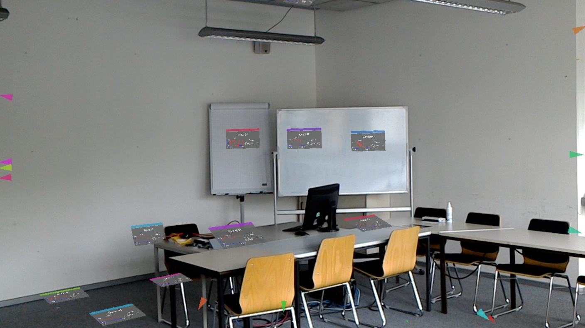

# IoT Visualization using Mixed Reality

This repository contains the documentation and the source code of my bachelor thesis, which is about visualizing the Internet of Things using Mixed Reality. For the Implementation I used a Microsoft HoloLens.

___
## Abstract
Here is the abstract of my work. A german version can be found below. The whole document will be released later.

### English

The number of devices which form the internet of things has increased in the recent years and is likely to follow this trend in the years to come. 
This leads to difficulties in localization and identification of devices.
To solve these problems this thesis presents a world-scale mixed reality visualization method and evaluates it against a current commonly used method. 
The evaluation took place in two steps. 
At first, the performance of the proposed system has been analysed to determine whether this solution is suitable for real world use cases and whether it scales well enough for real world environments. 
Secondly, a user study has been conducted to compare the proposed system with a more established one based on a two-dimensional computer application. 
Furthermore the occurence of side effects known from virtual reality like motion sickness and a perception based required minimum performance of the proposed solution have been examined within the study. 
The results of the first part show that the proposed system offers a performance that fits the requirements and a good scalability for bigger real world scenarios. 
The study showed no real advantage of either method during the conducted tests. 
In most cases the mixed reality solution has been on par with the conventional application. 
Also no negative side effects have been observed during the use of mixed reality and most participants were satisfied with the proposed method. 
At the end further improvements and ideas to solve the given problems are presented for future work.

### German

Die Anzahl der Geräte im IoT nahm in den letzten Jahren stark zu und wird diesem Trend voraussichtlich auch noch über die nächsten Jahre folgen. 
Die Zuordnung von Informationen zu Geräten und das Finden von Geräten an sich stellen dabei größer werdende Probleme dar.
Im Rahmen dieser Bachelorarbeit wurde ein World-Scale Mixed Reality-System entworfen und implementiert, welches sich diesem Problem annimmt. 
Die Evaluation dieses Systems fand in zwei Schritten statt. 
Im ersten Schritt wurde die Leistung des entworfenen Systems betrachtet, um dessen reale Anwendbarkeit und Skalierbarkeit einschätzen zu können. 
Im zweiten Schritt wurde eine Nutzerstudie durchgeführt, in welcher das MR-System gegen ein etablierteres System in Form einer zweidimensionalen Computeranwendung verglichen wurde. 
Außerdem wurde im Rahmen der Studie eine benötigte Mindestleistung des Systems auf Basis von Nutzerwahrnehmungen und das Aufkommen von aus Virtual-Reality-Umgebungen bekannte Nebenwirkungen untersucht. 
Das Ergebnis des ersten Teils zeigt, dass die vorgestellte System eine ausreichende Leistung liefert und auch größere Zahlen an Geräten bewältigen kann. 
Die Studie zeigt außerdem, dass das System ähnliche Ergebnisse wie die Vergleichsanwendung erzielte. 
VR-typische Nebenwirkungen sind nicht aufgetreten und die Probanden waren mit dem System zufrieden und empfanden es als hilfreich.
Am Ende werden noch mögliche Verbesserungen und Ideen zur Lösung der genannten Probleme für zukünftige Arbeiten vorgeschlagen. 
